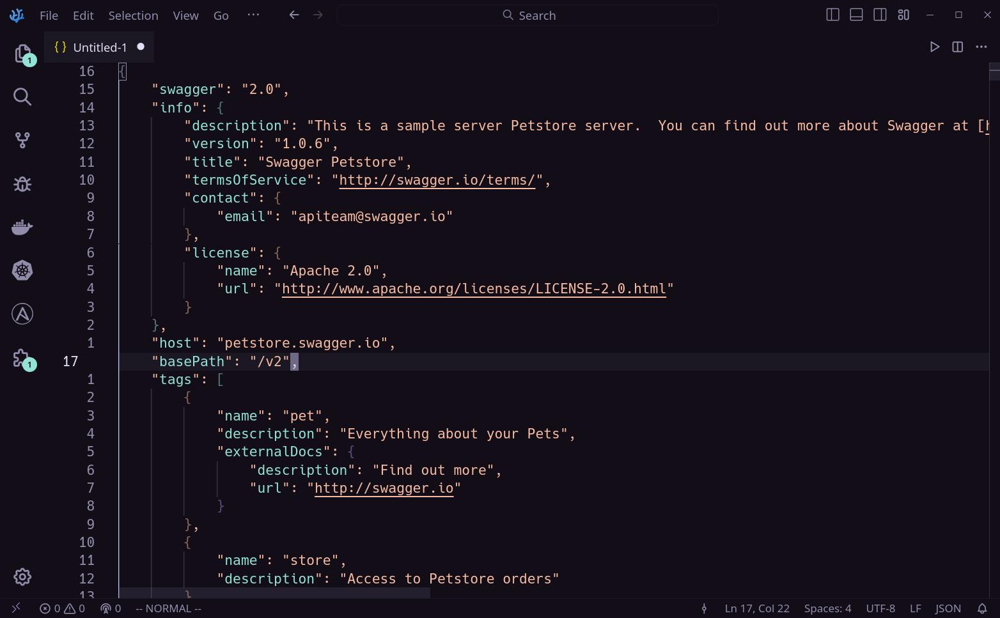

    
    <h2 align="center">Roxo for VSCode</h2>

A low-contrast, eye-friendly, dark purple theme.

## Usage

1. Open VSCode
2. Search for `Roxo theme` in extensions
3. Install the theme and choose your variant in `Preferences: Color theme`
